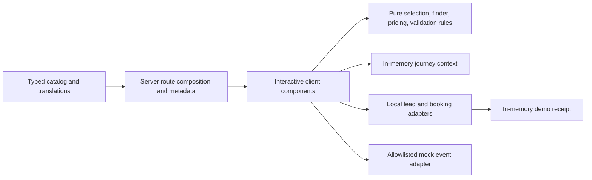

MODE: EXECUTE
ROLE: ARCH

# Summary

**Scope extension:** the user subsequently requested complete English, Spanish, French and German public experiences. The original phase plan below is retained as design history; `LOCALIZATION.md` and `ROUTES_AND_SEO.md` define the current four language contract. The extension is Tier S2 within the existing locale mechanism. Locale acceptance and receipt/state rules were tested against the old implementation before enabling new languages. Prices, mock providers and noindex safeguards remain unchanged.

Implement the supplied Paraguay website handoff as a runnable local prototype, starting with a complete residency conversion journey and then finishing the finder, service catalog, Spanish core experience, and verification. Tier: S1 because this creates a new customer-facing feature. The existing approved handoff is the product specification; this document translates it into bounded implementation work rather than reopening idea intake.

# Requirements

- Complete Phases 1–4 and all English routes in the source handoff. Complete Spanish for the named core conversion routes, including errors and metadata.
- Preserve stable service/package context from entry through comparison, finder, inquiry, locale changes, and receipt.
- Keep all offers provisional, all integrations local mocks, all preview routes noindex, and all personal drafts only in browser memory.
- Provide meaningful server-rendered marketing content, accessible responsive interactions, automated tests, build verification, and factual QA evidence.
- No public deployment, live messaging, external tracking, document collection, payments, CRM, database, customer portal, or legal eligibility claims.
- All unresolved business inputs are documented defaults or launch gates; they do not block the prototype.

# Architecture

The inspected workspace contained the handoff documents and no application or package manager to preserve. Create the isolated `paraguay-residency-site` application using Next.js App Router, React, strict TypeScript, npm, and a small CSS component system. Prefer native semantic controls and a small typed domain over new services or generalized infrastructure.

Marketing pages compose server-rendered content. Client islands manage finder, comparison, inquiry, scheduler, navigation, and mock messaging. Pure business rules cannot depend on React or provider SDKs. Local adapters implement submission behavior; UI never makes provider requests.



The following tree defines responsibilities; existing implementation filenames may consolidate related pure modules without changing the boundaries:

```text
paraguay-residency-site/
  src/
    app/                    # Locale route composition, server metadata, errors
    components/             # Shared shell, marketing primitives, interactive flows
    features/               # Finder and inquiry client interactions
    domain/                 # Framework-free catalog types, rules, validation
    application/            # Submission orchestration and local gateway contracts
    content/                # Central prices, service content, reviewed-source fields
    infrastructure/         # Local gateways; no external provider traffic
    lib/                    # Route, metadata, and sanitized analytics utilities
    config/                 # Replaceable brand and fail-closed demo defaults
  public/                   # Original/local preview assets; no external embeds
  tests/                    # Business contracts and browser journeys
  docs/                     # This plan, decisions, SEO map, QA, launch gates
```

# API Contracts

There are no public service APIs in this prototype. Interfaces are local application contracts:

| Interface | Input | Result / failure contract |
|---|---|---|
| Catalog lookup | Stable service/package ID | Known catalog record with its explicit approval state, or absent result; never an arbitrary display string |
| Selection parser | Allowlisted `service`, `plan`, `campaign` parameters | Safe coherent selection; ignore malformed or incompatible IDs; never accept return URLs |
| Finder transition | Current answers plus one changed answer | Preserve compatible answers; remove answers and selection invalidated by a changed goal |
| Recommendation | Relevant completed answers | Starting service/plan, reasons, provisional price or quote requirement, family quote flag; no eligibility judgment |
| Price formatter | Integer USD minor-unit fixed/range/quote value and locale | Localized amount plus basis; no household multiplication or invented missing values |
| Lead gateway | Validated contact draft, non-personal context, payload-bound idempotency key | Accepted demo receipt or sanitized failure; same payload retry reuses its key |
| Booking gateway | Future UTC instant, viewer IANA zone, injected clock | Confirmed demo time, unavailable-time outcome, or simulated failure |
| Messaging gateway | Valid catalog context | Local message preview with sending disabled; no automatic navigation to a provider |
| Analytics adapter | Named event plus allowlisted properties | In-memory/no-op sanitized event; reject personal data and raw URLs |
| Indexability gate | Page approval record plus runtime origin/mode | False unless every live approval condition passes; demo always false |

Submission states are idle, invalid, pending, simulated success, simulated failure, unavailable time, and retry. No successful receipt or conversion event exists until the adapter accepts the request. Refreshing or directly visiting confirmation must show neutral recovery instead of a synthetic success. HTTP route errors use real 404 responses for unknown paths/locales; mock submission errors are UI/application outcomes, not a fake production HTTP API.

# Module Descriptions

- **Catalog/content:** owns fixtures, price bases, distinct inclusion states, localized labels, original scoped service descriptions, and explicit content/commercial approval fields.
- **Domain:** owns deterministic recommendations, safe routing parameters, price formatting, validation, future-slot generation, event allowlisting, and live-readiness rules.
- **Journey UI:** owns accessible rendering and in-memory state; personal details are never serialized into storage, query strings, events, or logs.
- **Local gateways:** expose controllable success, failure, and unavailable outcomes with injectable time. Providers can later replace these interfaces without changing domain rules.
- **Route/SEO composition:** owns complete locale availability, canonical URLs, reciprocal real translations, social previews, noindex headers/metadata, and a draft-free sitemap.

# Tasks by Agent

- **BACKEND/domain:** write failing tests first for prices, selection validity, finder transitions, attribution, submission/idempotency, timezones, and indexability; implement pure rules and local adapters.
- **FRONTEND:** compose the Phase 1 vertical slice first; then finder/campaigns and complete service/Spanish routes. Keep selected plan and price visible in inquiry and receipt. Implement all failure, recovery, loading, and no-JavaScript fallback states.
- **UX_UI:** define original responsive hierarchy, accessible controls, comparison behavior, sticky-action limits, neutral editorial placeholders, and RTL treatment.
- **QA:** exercise AC-01–AC-20, every route and primary CTA, desktop/mobile Chromium, WebKit smoke, keyboard, reflow, no-JavaScript marketing, and no external provider traffic.
- **REVIEWER:** check state/context loss, PII leakage, fabricated success, unsafe live mode, thin routes, unapproved claims, inaccessible errors, and tests that accidentally assert implementation details rather than behavior.

# Spec Updates

- Preserve the supplied handoff under `docs/` as the authoritative product specification.
- `DECISIONS.md` defines defaults and unresolved business inputs.
- `ROUTES_AND_SEO.md` defines route ownership, translation coverage, and indexing contracts.
- `LAUNCH_CHECKLIST.md` records owner/evidence requirements for future public launch.
- `QA_REPORT.md` records actual commands, outcomes, and evidence after verification; it must not claim unexecuted checks.
- Do not create redundant top-level architecture/contract/UX documents: this plan and the detailed source handoff contain those contracts, and the scoped deliverables avoid conflicting sources of truth.

# Tests

Use Vitest for pure business rules and interaction contracts and Playwright for full browser flows. Test first for every business rule/state transition; run production build separately from dev checks. No repository coverage threshold existed at intake, so do not invent a percentage gate. Prioritize meaningful contract coverage of AC-01–AC-20.

Critical cases include changed-goal resets, family quote without invented totals, upgrade routing, non-residency branching, missing/invalid plan IDs, repeated submit and retry, new key on changed payload, unavailable/past slots, timezone display, missing/refreshed receipts, Spanish errors/context, raw-query rejection, event redaction, catalog consistency, and fail-closed live indexing. Test preview SEO and approved-mode SEO fixtures separately.

# Implementation Roadmap

1. **Phase 1 — foundation and vertical slice:** establish shell/tokens/catalog/demo configuration; implement homepage → pricing → inquiry → simulated receipt. Exit with AC-01, AC-08, AC-11, AC-12 and basic responsive checks passing.
2. **Phase 2 — guided/social acquisition:** finder with editable family defaults, branching/back behavior, campaign routes/link hub, allowlisted attribution, and sanitized mock events. Exit with AC-02–AC-07 and attribution tests passing.
3. **Phase 3 — breadth and discoverability:** finish all service/guide/about/contact/policy routes, distinct source fields, metadata/index gate/sitemap, Spanish core, and RTL fixture. Exit with AC-14–AC-17, AC-19, AC-20 passing.
4. **Phase 4 — hardening and delivery:** finish failure/retry/timezone checks, keyboard/accessibility/reflow, Chromium/WebKit checks, screenshot review, local production-build Lighthouse baselines, setup instructions, decisions, and launch gates. Record environmental blockers explicitly.
5. Run typecheck, lint, unit/integration tests, browser tests, a11y checks, and production build; independently inspect the built result and final files. The root owns final acceptance evidence; a subagent report alone is insufficient.

# Potential Challenges

- Parallel implementation can drift at interfaces: agree on stable IDs and pure contracts early, and keep ownership disjoint.
- Locale fallback can silently mislabel English as Spanish: expose only complete equivalents and label English-only destinations.
- Mock success can resemble a real booking: keep the demo banner, local-only adapters, and explicit receipt language at every conversion boundary.
- Lighthouse SEO scores conflict with required noindex: retain noindex and measure SEO policy against an approved-mode fixture separately.
- Browser availability may block a particular engine: report the exact limitation and remaining native-device checks instead of claiming coverage.

# GitHub Issue Update

- Issue: N/A.
- Status: not updated.
- Actions taken: no remote repository or tracking issue was supplied or present at intake.
- Proposed update: none required for the local prototype; no external bookkeeping or publication is implied.

# Acceptance Criteria

- All source-handoff routes resolve correctly and all primary actions work or honestly explain unavailable configuration.
- The same stable selected package and shared provisional price survive pricing → inquiry → demo receipt, including supported locale switches.
- All AC-01–AC-20 behaviors have meaningful automated and/or explicitly recorded manual evidence; unexecuted checks are identified.
- Demo requests cannot send provider traffic, collect documents/payments, write personal data to persistent storage, or claim a real booking/message.
- Every preview is noindex, unknown routes return 404, incomplete translations are not advertised, and unapproved live configuration fails closed.
- The local application runs using documented Windows-compatible commands, builds successfully, and ships actual test/build/responsive evidence plus business launch gates.

# Assumptions and Open Questions

The detailed handoff authorizes implementation with documented defaults. The working brand, prices, content responsibilities, and 20-minute demo consultation are provisional. No live business approval, production origin, credentials, licensed people imagery, or integration endpoint is assumed. Business decisions in `DECISIONS.md` are non-blocking for the prototype and blocking for launch. There are no architecture questions that require delaying this local implementation.

# Next Steps

BACKEND/domain and FRONTEND implement against the common contracts; UX_UI supplies responsive decisions; VERIFIER then REVIEWER then QA validate the integrated result. HUMAN decides any later public launch. No deployment is part of this task.

HANDOFF_TO: FRONTEND
